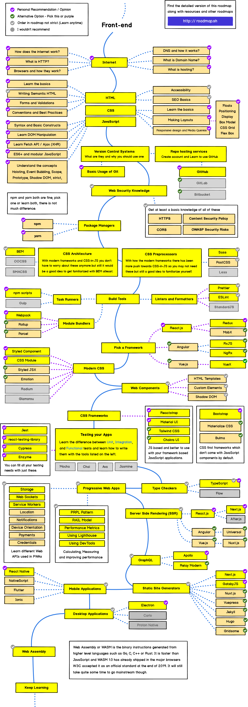

# web-dev-resources
This repository will be a collection of links to learn while following the [frontend-roadmap-path](https://roadmap.sh/frontend)
For the complete roadmap please check the link provided above or the image ad the end of this README.

## ROADMAP
### HTML
* [selfhtml](https://wiki.selfhtml.org/wiki/HTML/Tutorials/Einstieg) - Beginner friendly html tutorial. Might only be available in german
* [html-elements](https://wiki.selfhtml.org/wiki/HTML/Elemente) - List of all current html elements for easier referencing
### CSS
* [selfhtml](https://wiki.selfhtml.org/wiki/CSS/Tutorials/Einstieg) - Beginner friendly html tutorial. Might only be available in german
* [CSS Diner](https://flukeout.github.io/) - Learning CSS-selectors with CSS Diner
### JAVASCRIPT
WIP

